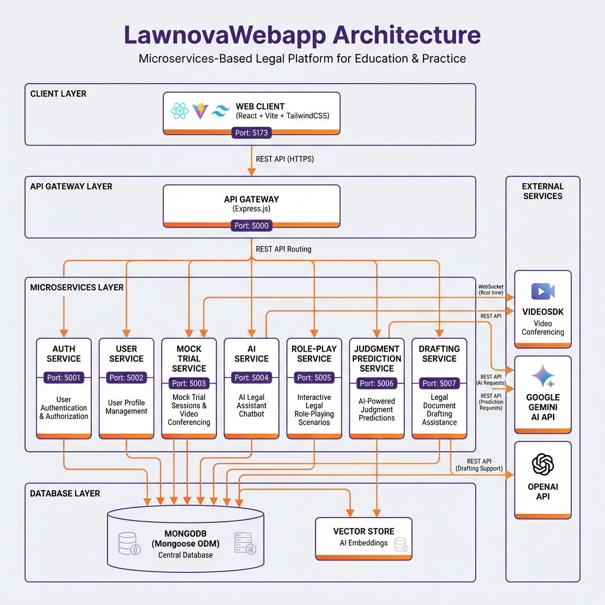

# LawnovaWebapp

> **Legal Learning Scheduler & Mock Trial Portal** - A comprehensive microservices-based legal education platform powered by AI

[](https://opensource.org/licenses/MIT)
[](https://nodejs.org/)
[](https://reactjs.org/)
[](https://www.mongodb.com/)

---

## 📋 Table of Contents

- [Overview](#overview)
- [Architecture](#architecture)
- [Key Features](#key-features)
- [Technology Stack](#technology-stack)
- [Project Structure](#project-structure)
- [Getting Started](#getting-started)
  - [Prerequisites](#prerequisites)
  - [Installation](#installation)
  - [Environment Configuration](#environment-configuration)
  - [Running the Application](#running-the-application)
- [Microservices](#microservices)
- [API Documentation](#api-documentation)
- [Version Control Guidelines](#version-control-guidelines)
- [Contributing](#contributing)
- [Team](#team)
- [License](#license)

---

## 🎯 Overview

**LawnovaWebapp** is an innovative legal education platform designed to provide law students and legal professionals with interactive, AI-powered tools for learning and practicing legal skills. The platform leverages a microservices architecture to deliver scalable, maintainable, and feature-rich experiences.

### Project Vision

To revolutionize legal education by providing:
- **Interactive Mock Trials** with real-time video conferencing
- **AI-Powered Legal Assistance** for research and argumentation
- **Judgment Prediction** using machine learning and legal precedents
- **Role-Playing Scenarios** based on Sri Lankan law
- **Document Drafting** assistance for legal professionals

### Target Audience

- Law students preparing for courtroom practice
- Legal professionals seeking skill enhancement
- Academic institutions offering legal education
- Legal aid organizations training volunteers

---

## 🏗️ Architecture

LawnovaWebapp follows a **microservices architecture** pattern, ensuring scalability, maintainability, and independent deployment of services.



### Architecture Layers

#### 1. **Client Layer**
- **Web Client** (React + Vite + TailwindCSS)
- Port: `5173`
- Communicates with API Gateway via REST API and WebSockets

#### 2. **API Gateway Layer**
- **API Gateway** (Express.js)
- Port: `5000`
- Routes requests to appropriate microservices
- Handles authentication middleware
- Implements rate limiting and security headers

#### 3. **Microservices Layer**

| Service | Port | Responsibility |
|---------|------|----------------|
| **Auth Service** | 5001 | User authentication & authorization (JWT) |
| **User Service** | 5002 | User profile management & preferences |
| **Mock Trial Service** | 5003 | Mock trial sessions, video conferencing, real-time collaboration |
| **AI Service** | 5004 | AI legal assistant chatbot with streaming responses |
| **Role-Play Service** | 5005 | Interactive legal role-playing scenarios (Sri Lankan law) |
| **Judgment Prediction Service** | 5006 | AI-powered legal judgment predictions |
| **Drafting Service** | 5007 | Legal document drafting assistance |

#### 4. **Database Layer**
- **MongoDB** (Mongoose ODM) - Main database
- **Vector Store** - AI embeddings for semantic search

#### 5. **External Services**
- **VideoSDK** - Real-time video conferencing
- **Google Gemini AI** - Advanced AI capabilities

---

## ✨ Key Features

### 1. **Mock Trial Sessions**
- Create and join virtual courtroom sessions
- Real-time video conferencing with participants
- Role assignment (Judge, Prosecutor, Defense, Witness)
- Live transcription and recording
- Session scheduling and management

### 2. **AI Legal Assistant**
- Real-time legal research support
- Argument suggestions based on case context
- Statute and precedent citations
- Streaming responses for better UX
- Context-aware recommendations

### 3. **Judgment Prediction**
- AI-powered prediction based on case facts
- Confidence scoring with visual gauges
- Similar case precedents analysis
- Relevant statute identification
- Detailed reasoning and justification

### 4. **Interactive Role-Playing**
- AI-generated legal scenarios (Sri Lankan law)
- Multi-day trial progression
- Dynamic AI responses as opposing counsel
- Cross-examination practice
- Performance feedback and analytics

### 5. **Legal Document Drafting**
- Template-based document generation
- AI-assisted content suggestions
- Legal compliance checking
- Version control for documents

### 6. **Learning Materials**
- AI-generated quizzes from session content
- Legal concept explanations
- Case study analysis
- Interactive learning modules

---

## 🛠️ Technology Stack

### **Frontend**

| Technology | Version | Purpose |
|------------|---------|---------|
| React | 18.2.0 | UI library for building interactive interfaces |
| Vite | 5.1.6 | Fast build tool and dev server |
| TailwindCSS | 3.4.1 | Utility-first CSS framework |
| React Router | 6.22.3 | Client-side routing |
| Axios | 1.6.7 | HTTP client for API requests |
| React Hook Form | 7.51.0 | Form validation and management |
| Zod | 3.22.4 | Schema validation |
| Lucide React | 0.344.0 | Icon library |

### **Backend**

| Technology | Version | Purpose |
|------------|---------|---------|
| Node.js | 18+ | JavaScript runtime |
| Express.js | 4.18.2 | Web framework for APIs |
| MongoDB | 8.0+ | NoSQL database |
| Mongoose | 8.0.0 | MongoDB ODM |
| Socket.io | 4.7.2 | Real-time bidirectional communication |
| JWT | 9.0.3 | Stateless authentication |
| bcryptjs | 2.4.3 | Password hashing |
| Helmet | 7.1.0 | Security middleware |
| Winston | 3.19.0 | Logging library |

### **External APIs & Services**

| Service | Purpose |
|---------|---------|
| VideoSDK | Real-time video conferencing |
| Google Gemini AI | Advanced AI text generation |
| Vector Store | Semantic search for legal documents |

### **Development Tools**

| Tool | Purpose |
|------|---------|
| Git | Version control |
| Nodemon | Auto-restart during development |
| ESLint | Code linting |
| Jest | Unit testing |
| Supertest | API testing |

---

## 📁 Project Structure

```
LawnovaWebapp/
├── .git/                           # Git repository
├── .github/                        # GitHub workflows and configs
├── .vscode/                        # VS Code settings
├── api-gateway/                    # API Gateway (port 5000)
│   ├── server.js                   # Gateway entry point
│   ├── middleware/                 # Auth, rate limiting, proxies
│   └── routes/                     # Route definitions
├── services/                       # Microservices
│   ├── auth-service/               # Port 5001
│   │   ├── server.js
│   │   ├── models/
│   │   ├── controllers/
│   │   └── routes/
│   ├── user-service/               # Port 5002
│   │   └── src/
│   ├── mocktrial-service/          # Port 5003
│   │   └── src/
│   │       ├── models/             # TrialSession, Participant
│   │       ├── controllers/
│   │       ├── routes/
│   │       └── services/           # VideoSDK integration
│   ├── ai-service/                 # Port 5004
│   │   └── src/
│   │       ├── controllers/        # AI assistant, embeddings
│   │       ├── services/           # Gemini AI integration
│   │       └── data/               # Mock case data
│   ├── roleplay-service/           # Port 5005
│   │   ├── models/                 # TrialSession
│   │   ├── controllers/
│   │   └── routes/
│   ├── judgment-prediction-service/ # Port 5006
│   └── drafting-service/           # Port 5007
├── web-client/                     # React frontend (port 5173)
│   ├── src/
│   │   ├── components/             # Reusable UI components
│   │   ├── pages/                  # Route pages
│   │   │   ├── Login.jsx
│   │   │   ├── Dashboard.jsx
│   │   │   ├── CourtroomPage.jsx
│   │   │   └── JudgmentPrediction.jsx
│   │   ├── contexts/               # React contexts
│   │   ├── hooks/                  # Custom hooks
│   │   ├── utils/                  # Utilities
│   │   └── App.jsx                 # Main app component
│   ├── index.html
│   ├── package.json
│   └── vite.config.js
├── shared-libs/                    # Shared utilities
├── database/                       # Database scripts
├── deployment/                     # Deployment configs
├── scripts/                        # Utility scripts
├── .env                            # Environment variables
├── .gitignore                      # Git ignore rules
├── package.json                    # Root dependencies
├── LEGAL_JUDGMENT_PREDICTION_GUIDE.md
├── ARGUMENT_AUDIT_GUIDE.md
├── MULTI_DAY_NAVIGATION_GUIDE.md
└── README.md                       # This file
```

---

## 🚀 Getting Started

### Prerequisites

Before running LawnovaWebapp, ensure you have the following installed:

- **Node.js** (v18.x or higher) - [Download](https://nodejs.org/)
- **npm** (v9.x or higher) - Comes with Node.js
- **MongoDB** (v8.x or higher) - [Download](https://www.mongodb.com/try/download/community) or use MongoDB Atlas
- **Git** - [Download](https://git-scm.com/)

### Installation

1. **Clone the repository:**

```bash
git clone <repository-url>
cd LawnovaWebapp
```

2. **Install root dependencies:**

```bash
npm install
```

3. **Install service dependencies:**

```bash
# Install API Gateway dependencies
cd api-gateway
npm install
cd ..

# Install frontend dependencies
cd web-client
npm install
cd ..

# Install individual service dependencies
cd services/auth-service
npm install
cd ../..

cd services/user-service
npm install
cd ../..

cd services/mocktrial-service
npm install
cd ../..

cd services/ai-service
npm install
cd ../..

cd services/roleplay-service
npm install
cd ../..
```

### Environment Configuration

Create `.env` files in the root directory and relevant service directories:

#### **Root `.env`**

```env
# MongoDB
MONGODB_URI=mongodb://localhost:27017/lawnova

# JWT
JWT_SECRET=your-super-secret-jwt-key-here

# External APIs
GEMINI_API_KEY=your-gemini-api-key
VIDEOSDK_API_KEY=your-videosdk-api-key
VIDEOSDK_SECRET_KEY=your-videosdk-secret-key

# Service Ports
AUTH_SERVICE_PORT=5001
USER_SERVICE_PORT=5002
MOCKTRIAL_SERVICE_PORT=5003
AI_SERVICE_PORT=5004
ROLEPLAY_SERVICE_PORT=5005
JUDGMENT_PREDICTION_PORT=5006
DRAFTING_SERVICE_PORT=5007

# API Gateway
API_GATEWAY_PORT=5000
CLIENT_URL=http://localhost:5173

# Node Environment
NODE_ENV=development
```

#### **Web Client `.env`** (`web-client/.env`)

```env
VITE_API_URL=http://localhost:5000
VITE_WS_URL=ws://localhost:5000
```

### Running the Application

#### **Option 1: Run All Services Individually**

Open separate terminal windows for each service:

```bash
# Terminal 1: API Gateway
npm run dev

# Terminal 2: Auth Service
npm run dev:auth

# Terminal 3: Mock Trial Service
npm run dev:mocktrial

# Terminal 4: User Service
npm run dev:user

# Terminal 5: AI Service
cd services/ai-service
npm run dev

# Terminal 6: Role-Play Service
cd services/roleplay-service
npm run dev

# Terminal 7: Frontend
cd web-client
npm run dev
```

#### **Option 2: Production Build**

```bash
# Build frontend
cd web-client
npm run build

# Start API Gateway
cd ..
npm start
```

#### **Access the Application**

- **Frontend:** http://localhost:5173
- **API Gateway:** http://localhost:5000
- **Backend Services:** Ports 5001-5007

---

##  Microservices

### 1. **Auth Service** (Port 5001)

**Responsibilities:**
- User registration and login
- JWT token generation and validation
- Password hashing and verification
- Session management

**Key Endpoints:**
- `POST /auth/register` - Register new user
- `POST /auth/login` - User login
- `POST /auth/logout` - User logout
- `GET /auth/verify` - Verify JWT token

### 2. **User Service** (Port 5002)

**Responsibilities:**
- User profile management
- Preferences and settings
- User analytics

**Key Endpoints:**
- `GET /users/profile` - Get user profile
- `PUT /users/profile` - Update profile
- `GET /users/:id` - Get user by ID

### 3. **Mock Trial Service** (Port 5003)

**Responsibilities:**
- Mock trial session creation and management
- VideoSDK integration for video conferencing
- Real-time participant management
- Session transcription and recording
- Role assignment

**Key Endpoints:**
- `POST /mocktrial/sessions` - Create session
- `GET /mocktrial/sessions/:id` - Get session details
- `POST /mocktrial/sessions/:id/join` - Join session
- `POST /mocktrial/sessions/:id/assign-role` - Assign participant role
- `GET /mocktrial/sessions/:id/token` - Get VideoSDK token

**WebSocket Events:**
- `participant-joined` - New participant joined
- `participant-left` - Participant left
- `role-assigned` - Role assigned to participant

### 4. **AI Service** (Port 5004)

**Responsibilities:**
- AI legal assistant chatbot
- Streaming SSE responses
- Argument suggestions
- Statute citations
- Vector embeddings for semantic search

**Key Endpoints:**
- `POST /ai/assistant/chat` - Chat with AI (SSE streaming)
- `POST /ai/embeddings` - Generate embeddings
- `POST /ai/argument-suggestions` - Get argument suggestions

### 5. **Role-Play Service** (Port 5005)

**Responsibilities:**
- Generate AI legal scenarios (Sri Lankan law)
- Manage trial progression
- Handle cross-examination
- Provide AI responses as opposing counsel

**Key Endpoints:**
- `POST /roleplay/init-trial` - Initialize trial session
- `POST /roleplay/interact` - Submit action and get AI response
- `POST /roleplay/advance-day` - Advance to next day

### 6. **Judgment Prediction Service** (Port 5006)

**Responsibilities:**
- Predict legal judgments using AI
- Confidence scoring
- Similar case analysis
- Statute identification

**Key Endpoints:**
- `POST /prediction/predict-judgment` - Predict judgment

### 7. **Drafting Service** (Port 5007)

**Responsibilities:**
- Legal document drafting assistance
- Template management
- AI content suggestions

---

##  API Documentation

### Authentication

Most endpoints require JWT authentication. Include the token in the `Authorization` header:

```
Authorization: Bearer <your-jwt-token>
```

### Example API Call

```javascript
// Login
const response = await fetch('http://localhost:5000/api/auth/login', {
  method: 'POST',
  headers: {
    'Content-Type': 'application/json',
  },
  body: JSON.stringify({
    email: 'user@example.com',
    password: 'password123'
  })
});

const { token } = await response.json();

// Use token for authenticated requests
const sessionsResponse = await fetch('http://localhost:5000/api/mocktrial/sessions', {
  headers: {
    'Authorization': `Bearer ${token}`
  }
});
```

---

##  Version Control Guidelines

This project uses **Git** for version control. Please follow these best practices:

### Branch Strategy

- **`main`** - Production-ready code
- **`development`** - Integration branch for features
- **`feature/<feature-name>`** - Individual feature branches
- **`bugfix/<bug-name>`** - Bug fix branches
- **`hotfix/<issue-name>`** - Critical production fixes

### Commit Guidelines

Follow **Conventional Commits** format:

```
<type>(<scope>): <subject>

<body>

<footer>
```

**Types:**
- `feat` - New feature
- `fix` - Bug fix
- `docs` - Documentation changes
- `style` - Code style changes (formatting)
- `refactor` - Code refactoring
- `test` - Adding tests
- `chore` - Maintenance tasks

**Examples:**

```bash
git commit -m "feat(auth): add JWT token refresh endpoint"
git commit -m "fix(mocktrial): resolve video connection timeout issue"
git commit -m "docs(readme): update installation instructions"
```

### Workflow

1. **Create a feature branch:**

```bash
git checkout -b feature/judgment-prediction
```

2. **Make changes and commit frequently:**

```bash
git add .
git commit -m "feat(prediction): add TF-IDF similarity matching"
```

3. **Push to remote:**

```bash
git push origin feature/judgment-prediction
```

4. **Create a Pull Request** for code review

5. **Merge to development** after approval

### Repository Access

For evaluators and team collaboration:

1. **GitHub:** Ensure repository is set to **Public** or add evaluators as collaborators
2. **Share Repository Link**: `https://github.com/<username>/LawnovaWebapp`
3. **Grant Read Access**: Add evaluator emails in repository settings

---

##  Contributing

We welcome contributions! Please follow these steps:

1. **Fork the repository**
2. **Create a feature branch** (`git checkout -b feature/amazing-feature`)
3. **Commit your changes** (`git commit -m 'feat: Add amazing feature'`)
4. **Push to the branch** (`git push origin feature/amazing-feature`)
5. **Open a Pull Request**

### Code Quality Standards

- Write clean, readable code
- Follow existing code style
- Add comments for complex logic
- Write unit tests for new features
- Update documentation

---

##  Team

**Lawnova Development Team**

- **Project Lead:** [Name]
- **Backend Developer:** [Name]
- **Frontend Developer:** [Name]
- **AI/ML Engineer:** [Name]
- **DevOps Engineer:** [Name]

---

##  License

This project is licensed under the **MIT License** - see the [LICENSE](LICENSE) file for details.

---

##  Support

For issues, questions, or contributions:

- **Email:** support@lawnova.com
- **GitHub Issues:** [Create an issue](https://github.com/<username>/LawnovaWebapp/issues)
- **Documentation:** See guides in `/docs` directory

---

##  Acknowledgments

- **VideoSDK** for video conferencing capabilities
- **Google Gemini AI** for advanced AI features
- **MongoDB** for database solutions
- All contributors and team members

---

**Built with by the Lawnova Team**

Last Updated: January 11, 2026
